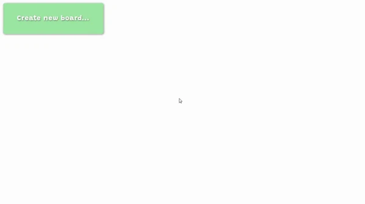

<h2>Training project</h2>
<h3>React app based on <a href="https://github.com/indreklasn/simple-trello">indreklasn/simple-trello</a></h3>

<h4>Skills to learn:</h4>
<ul>
  <li>React</li>
  <li>Webpack</li>
</ul>
<h4>Go to app: <a href="https://dendemo.github.io/trello/dist">dendemo.github.io/trello/dist</a></h4>
